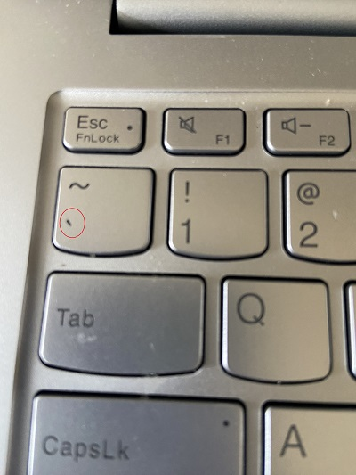
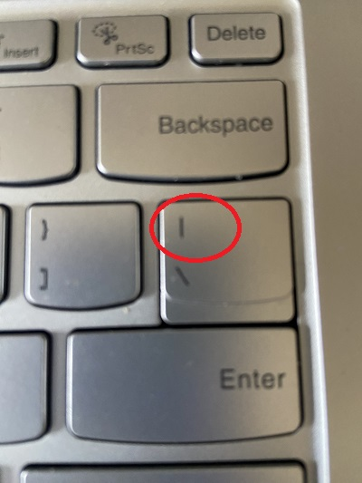

# WRITING GOOD DOCUMENTATION
## STEP 1: USING CODEBLOCKS
CodeBlocks in markdown makes it *very easy* to tech people to **copy, paste and share**.
A good __cloud Engineer__ uses codeblocks whenever possible.
Because it allows other people to copy, paste their code to replicate or research issues.

```
# Define a recursive function to calculate factorial
def factorial(n)
  if n <= 1
    return 1
  else
    return n * factorial(n - 1)
  end
end

# Get user input for the number
print "Enter a number: "
number = gets.chomp.to_i

# Calculate and display the factorial
if number < 0
  puts "Factorial is not defined for negative numbers."
else
  result = factorial(number)
  puts "The factorial of #{number} is #{result}."
end
```
- when you can attempt to syntax highlighting to your codeblocks.
```ruby
def factorial(n)
  if n <= 1
    return 1
  else
    return n * factorial(n - 1)
  end
end

# Get user input for the number
print "Enter a number: "
number = gets.chomp.to_i

# Calculate and display the factorial
if number < 0
  puts "Factorial is not defined for negative numbers."
else
  result = factorial(number)
  puts "The factorial of #{number} is #{result}."
end
```
- Make note of where the `backtick` keyboard key is located.
- It should appear above the `tab` key, 
- but it may vary based on your keyboard layout.
-  Add an Image. !()[]
-  resize the image use html




- Good cloud Engineers use codeblocks for both code and error that appear on the console.Error in the console should be always in the bash.
   
```bash
Traceback (most recent call last):
        1: from (irb):1
NameError (undefined local variable or method `undefined_variable' for main:Object)
```
> Here is an example of using a codeblock for an error that appears in bash.

When you can always provide a codeblock instead of a screenshot.
If you need to take a screenshot make sure it nots a photo from your phone.

> There are certain cases where its okay to take photos with your phone. This is when you are showing something like a keyboard, which does not appear on a computer screen. If it render on your computer screen it should be a screenshot.

## Step 1 - How to take screenshots

A screenshot is when you capture a part of you screen from your laptop, desktop or phone.

This is not be confused with take a photo with your phone.

**DON'T DO THIS**
his is what a screenshot from your computer should look like

**DO THIS INSTEAD**


To take screenshots on both macOS and Windows, you can use the following hotkeys:

**For macOS:**

1. **Entire Screen:** 
   - Press `Command (⌘) + Shift + 3`
   - The screenshot will be saved to your desktop by default.

2. **Selected Portion:**
   - Press `Command (⌘) + Shift + 4` 
   - Drag to select the area of the screen you want to capture.
   - The screenshot will be saved to your desktop by default.

3. **Capture a Window:** 
   - Press `Command (⌘) + Shift + 4`, then press `Spacebar`.
   - Click on the window you want to capture.
   - The screenshot will be saved to your desktop by default.

4. **Capture Touch Bar (if you have one):**
   - Press `Command (⌘) + Shift + 6`
   - The screenshot will be saved to your desktop by default.

**For Windows:**

1. **Entire Screen:** 
   - Press `PrtScn` (Print Screen) key.
   - The screenshot is copied to the clipboard. You can paste it into an application like Paint or Word.

2. **Active Window:** 
   - Press `Alt + PrtScn`
   - The screenshot of the active window is copied to the clipboard. You can paste it into an application.

3. **Selected Portion using Snip & Sketch (available in recent Windows versions):**
   - Press `Windows + Shift + S`
   - Your screen will dim, and you can select an area to capture.
   - The screenshot is copied to the clipboard. You can paste it into an application.

4. **Using Snipping Tool (available in older Windows versions):**
   - Search for "Snipping Tool" in the start menu.
   - Open the application and click on "New" to take a screenshot.
   - Save the screenshot.

For both operating systems, there are also third-party applications available that offer more advanced screenshot functionalities, but the above methods are built-in and don't require additional software.


## Step 3: Use Github flavored Markdown Task Lists
Markdown extends Markdown to have a list where you check off items [<sup>[1]</sup>](#external-references)

- [X] Finish step 1.
- [ ] Finish step 2.
- [X] Finish step 3.

## Step 4: Use Emojis (optional)
GitHub Flavored Markdown (GFM) supports Emojis shortcodes
Here are some examples:
| Name | Shortcode | Emoji |
| --- | --- | --- |
| cloud | `:cloud:` | :cloud: |
| --- | --- | --- |
| cloud with lightning | `:cloud_with_lightning` | 🌩️ |

## Step 5: How to create a Table
You can use the following markdown format to create the tables:

```md
| Name | Shortcode | Emoji |
| --- | --- | --- |
| cloud | `:cloud:` | :cloud: |
| --- | --- | --- |
| cloud with lightning | `:cloud_with_lightning` | 🌩️ |
```
Github extends the functionality of markdown tables to provide more alignment and table cell formating options. [<sup>[2]</sup>](#external-references)
- Make note of where the `pipe` keyboard key is located.
- It should appear above the `enter` key, 
- but it may vary based on your keyboard layout.
  


[secret-window hidden garden](secret-window/hidden-garden.md)
## External References

- [GitHub Flavored Markdown Spec](//github.github.com/gfm/)   
- [Basic writing and formatting syntax(Github Flavored markdown)](https://docs.github.com/en/get-started/writing-on-github/getting-started-with-writing-and-formatting-on-github/basic-writing-and-formatting-syntax)
- [GFM Task Lists](https://docs.github.com/en/get-started/writing-on-github/getting-started-with-writing-and-formatting-on-github/basic-writing-and-formatting-syntax#task-lists) <sup>[1]</sup>
- [GFM Emojis](https://github.com/markdown-templates/markdown-emojis)
- [GFM Tables(With Extensions)](https://github.github.com/gfm/#tables-extension-) <sup>[2]</sup>
